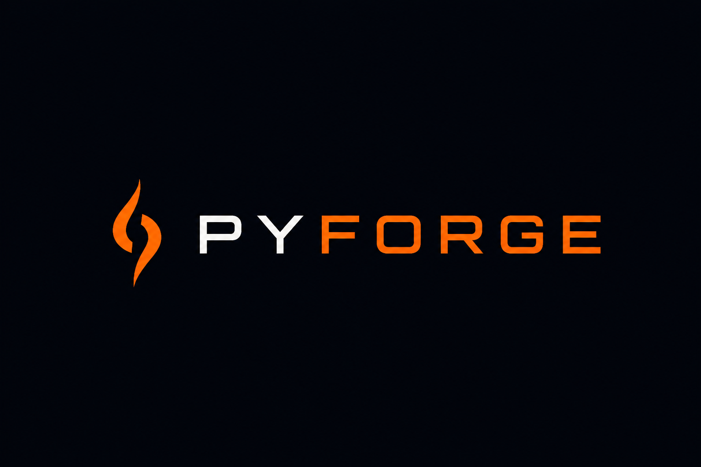

# Forge

A Python-to-GPU compiler that dynamically detects your GPU at runtime and emits optimized compute kernels.

## Overview

Forge queries your GPU's hardware capabilities at runtime and uses that information to generate and compile optimized kernel files. Currently building for CUDA, with multi-backend support planned.

## Architecture

- **Device Discovery**: Plugin-style system for runtime GPU detection and hardware querying
- **Device State**: Pydantic models representing hardware capabilities and configuration
- **Kernel Generation**: Capability-aware compute kernel emission
- **Compilation**: Clean pipeline from generated source to compiled output

The design enforces dynamic chip identification, with strict separation between device detection, kernel generation, and compilation stages.

## Backends

| Backend | Status |
|--------|--------|
| CUDA | In progress |
| ROCm (AMD) | Planned |
| Metal (Apple) | Planned |

## Status

Early development.

## Roadmap
- End-to-end codegen pipeline with a working `matmul` kernel
- Tiled shared memory optimization
- Additional ops (elementwise, transpose, etc.)
- Lightweight computation graph for kernel fusion
- Multi-backend support (ROCm, Metal)

## Requirements

- Python 3.x
- A supported GPU and its corresponding toolkit

## Getting Started

```bash
git clone https://github.com/jishjish/forge
cd forge
uv pip install -r requirements.txt
```