# Forge

A runtime GPU compiler that generates optimized compute kernels for portfolio analytics workloads.

## Overview

Forge queries your GPU's hardware capabilities at runtime and uses that information to generate and compile optimized kernel files. Currently building for CUDA/Metal, with multi-backend support planned.

## Architecture



- **Device Discovery**: Plugin-style system for runtime GPU detection and hardware querying
- **Device State**: Pydantic models representing hardware capabilities and configuration
- **Kernel Generation**: Capability-aware compute kernel emission
- **Compilation**: Clean pipeline from generated source to compiled output

The design enforces dynamic chip identification, with strict separation between device detection, kernel generation, and compilation stages.

## Backends

| Backend | Status |
|--------|--------|
| CUDA | In progress |
| ROCm (AMD) | In progress |
| Metal (Apple) | Planned |

## Status

Early development. Testing on Metal - need cloud GPU for CUDA.

## Roadmap
- End-to-end codegen pipeline with a working `log returns` kernel
<!-- - Tiled shared memory optimization -->
- Additional ops (`correlation matrix`, `efficient frontier`, etc.)
<!-- - Lightweight computation graph for kernel fusion -->
- Multi-backend support (ROCm, Metal)

## Requirements

- Python 3.x
- A supported GPU and its corresponding toolkit


## Getting Started

```bash
git clone https://github.com/jishjish/forge
cd forge
uv pip install -r requirements.txt
# coming soon: forge run examples/log_returns.py
```

> [!IMPORTANT]
In order to interface with Apple silicon, you must follow the install instructions [here](https://developer.apple.com/metal/cpp/). Currently, Forge is built on the `metal-cpp_26.4.zip` file. Once
you unzip the file inside of `third_party/` you must run `build_metal.sh` from project root to compile the metal shim. This generates the `.dylib` that Python loads and will then connect through
the `third_party/metal_shim.cpp` file.

> [!IMPORTANT]
If working on Mac (metal), you must run `sudo xcode-select --switch /Applications/Xcode.app/Contents/Developer` to set the Active Developer Directory on your device. If you want to only allow for a single session, run 
`export DEVELOPER_DIR="/Applications/Xcode.app/Contents/Developer"`
